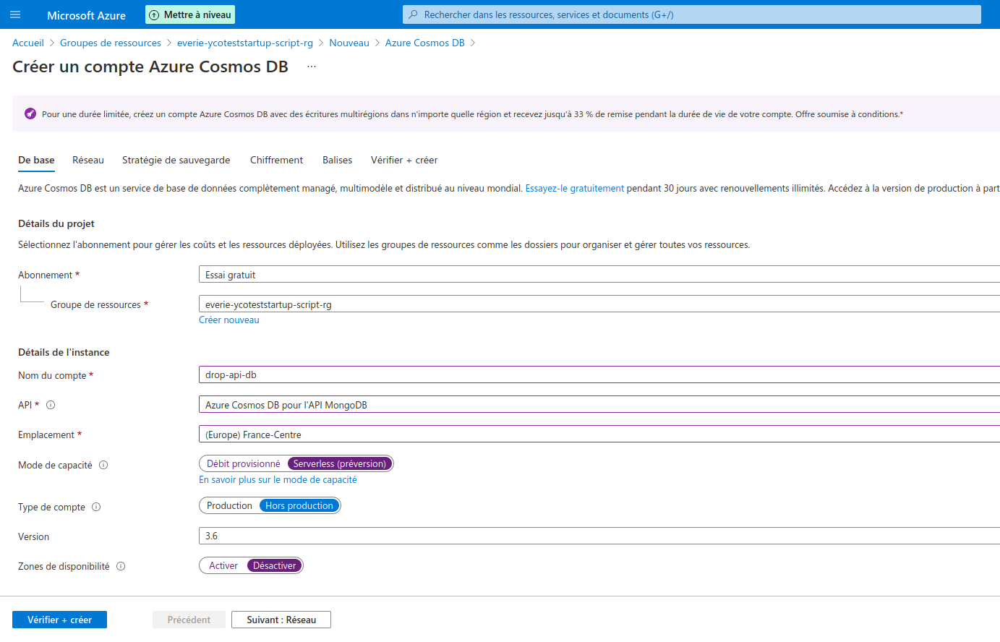

# Introduction

Ce code est basé sur : https://docs.microsoft.com/fr-fr/samples/azure-samples/azure-sql-db-python-rest-api/azure-sql-db-python-rest-api/


# Instruction pour les développeurs


## Installer AZURE cli

## Initialiser l'environnement

Après avoir cloné le repo il faut initialiser l'environnement en lançant le script

```
./install.sh
```

Le fichier .pre-commit-config.yaml est untlise


## Lancer l'application

Il faut d'abord charger les variables d'environnement locales pour l'interaction avec la base de donnée MongoDB
```
./env-local.sh
```

Puis lancer le script de démarrage
```
./startup.sh
```

## Tester l'application

Il faut d'abord installer les dépendances de dev:
```
poetry install
```
Il est nécessaire également d'avoir mongodb d'installé, cf https://docs.mongodb.com/manual/installation/.

Ensuite, pour lancer les tests automatiques:
```
cd app/
poetry run pytest
```

# Déploiement sur AZURE

## Se loguer sur AZURE
```
az login --tenant eadd0adf-e413-414f-a21a-86169869dcb1
```

## Initialiser les variables d'environnement et la souscription courante
```
. ./env-azure.sh
```

## Créer le groupe de ressources
```
./azure-rg.sh
```

## Créer le compte CosmosDB

Le nom du compte CosmosDB se trouve dans la variable d'environnement __${dbName}__

Dans le portail AZURE créer un compte Cosmos DB en s'inspirant de la compie d'écrans suivante :



Créer la collection en lançant le script suivant

```
./azure-cosmodb.sh
```

Documentation sur la chaine de connextion
https://docs.microsoft.com/en-us/azure/cosmos-db/scripts/cli/common/keys

## Déployer l'application

```
./azure-app.sh
```

## Activer l'authentification AZURE AD

Tout d'abord il faut inscrire l'application auprès de l'annuaire AD. C'est expliqué ici : https://docs.microsoft.com/fr-fr/azure/active-directory/develop/scenario-web-app-sign-user-app-registration?tabs=aspnetcore

Dans le portail d'administration, sous AZURE Active Directory, aller dans le "Gérer > Inscription d'application"

Cliqer sur "+ Nouvelle inscription"

- Saisir le nom "everie-drop-api"
- Cocher "Comptes dans cet annuaire d'organisation uniquement (Répertoire par défaut uniquement - Locataire unique)"

Ensuite cliquer sur "Certificats & secrets" et "+ Nouveau secret client"
Noter la valeur du secret

Ensuite il faut aller dans le paramétrage de l'application et choisir le menu "Authentification / Autorisation"

Cliquer sur "Activé"
puis dans la liste déroulante "Action à exécuter quand une demande n'est pas authentifiée" choisir "Se connecter avec Azure Active Directory"

Dans "Paramètres Azure Active Directory" choisir le mode express et "Sélectionner une application AD existante". Choisir alors l'application everie-drop-api.


## Mettre à jour l'application

- Dans le portail AZURE aller sur l'application puis dans le "Centre de déploiement"
- Cliquer sur Redéployer/synchroniser
